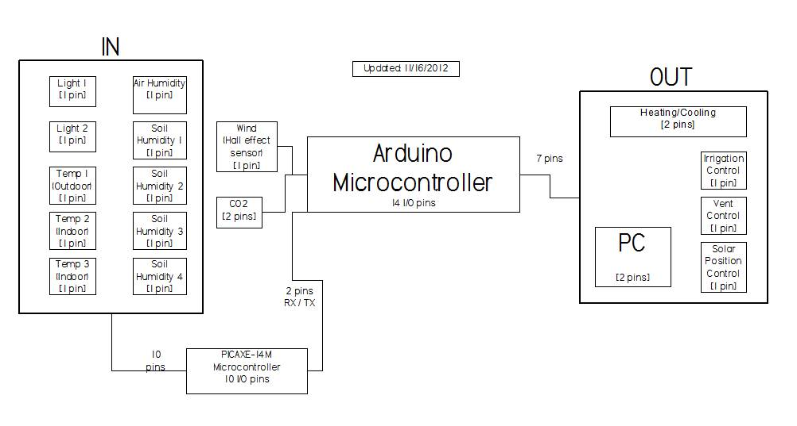

{}

{}
This article originally appeared back in 2012 on my (Alex's) blog on Northwest 
Tech Experience (nwteche.com). That website has been removed and I migrated some
of my content to this new site. I may have edited the original content for clarity.
{}

In a college class this last year, a group of us were assigned to design a 
system that would collect and graph environmental data from our campus 
greenhouse. We would take this data, graph it, and display those graphs on a 
[public website](https://sites.google.com/site/coccgreenhousedatacollection/home). 
We’d also use current data to control the greenhouse (i.e. watering, heating, 
cooling…). Hopefully this information helps you if you are wanting to start your
 own DIY project and automate your greenhouse.

We decided to use an [Arduino UNO](https://store.arduino.cc/usa/arduino-uno-rev3), 
a [PICAXE-14M2](http://www.picaxe.com/Hardware/PICAXE-Chips/PICAXE-14M2-microcontroller/), 
and a desktop computer running Windows Vista. The Arduino functioned as the main 
interface and brain. We dedicated the PICAXE to simply reading sensors and 
sending that data in a continuous stream to the Arduino via a serial 
communication protocol.

The Arduino would format and send data to be logged to the PC, which runs 
[MegunoLink](https://www.megunolink.com/). The Arduino would also decide, based 
on environmental conditions, if the heater/cooler/water should be turned on. 
Future groups working on the project would have to decided whether the Arduino 
would do this by sending a command to a dedicated microcontroller (reverse of 
what we did with the PICAXE being dedicated to sensors) or by directly 
controlling equipment in the greenhouse.

So, in essence, for this project, we figured out how to set up data logging and 
automation of the greenhouse environment using cheap materials and open source 
equipment. We didn't have the time to build the complete working system, so our
final documentation was targeted at the next group that would use our research
to realize the project.

- [IT Budget/Component Pricing.pdf](./IT-Budget.pdf)

{}
I'm sharing this here in case some DIY hobbyist could find the original
information useful.

Now in 2020, it might make more sense to use a Raspberry Pi as the brains, and 
replace the PICAXE with an Arduino for I/O interfacing. The parts may be a 
little more expensive, but the connectivity and control options seem a lot more flexible.

Programming a greenhouse controller in Python running on a network-connected
Pi seems like a lot of fun. And, if you can spend a little more money, the
Arduino shields for relays and sensors would simplify the wiring process!
{}

## Datasheets

- CO2 Sensor: [GE Telaire T6004 CDS-1](/datasheets/Spec-Sheet-GE-Telaire-T6004-CDS-1.pdf)
- Hall Effect Sensor: [Melexis MLX90217](/datasheets/Melexis-Datasheet-MLX90217.pdf)
- Humidity Sensor: [Humirel HS1101](/datasheets/Humirel-Datasheet-HS1101.pdf)
- Humidity Sensor: [Parallax HS1101](/datasheets/Parallax-Data-Sheet-HS1101-v1.0.pdf)
- Photoresistor: [PerkinElmer 9800015](/datasheets/Photoresitor-Perkinelmer_Actives-and-Passives_9800015.pdf)
- Temperature Sensor: [TI LM34](/datasheets/Data-Sheet-Texas-Instruments-LM34.pdf)

## Images

